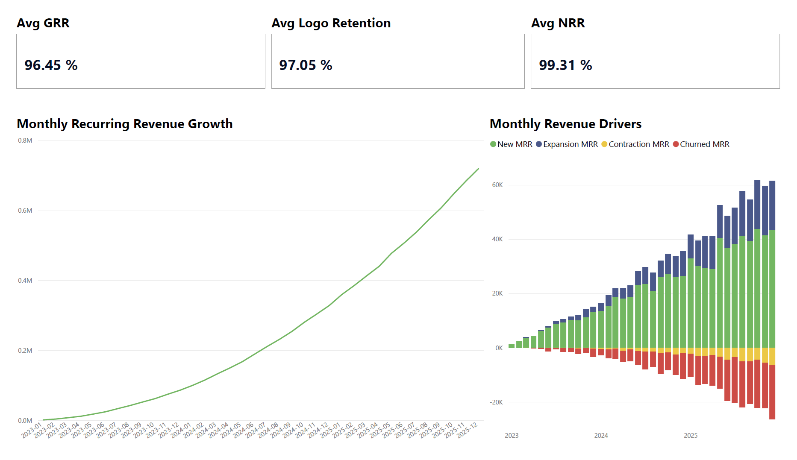

# B2B SaaS Revenue & Retention Analytics System  

### Production-Style SQL Pipeline + Power BI Executive Dashboard  

---

## 1. Executive Summary  

This project builds a **production-style analytics system** to evaluate subscription growth health and sustainability for a B2B SaaS business.  

It answers the executive question:  

> **Is our growth healthy, sustainable, and efficient?**  

The system measures:

- Revenue composition (New / Expansion / Contraction / Churn)  
- Monthly Recurring Revenue (MRR) reconciliation  
- Customer retention (logo retention)  
- Gross Revenue Retention (GRR)  
- Net Revenue Retention (NRR)  
- Cohort behavior over time  

Growth efficiency and SaaS unit economics:

- Customer Acquisition Cost (CAC)  
- Average Revenue Per User (ARPU)  
- Customer churn rate  
- Lifetime Value (LTV) approximation  
- LTV/CAC ratio

The dataset is synthetic but engineered to simulate realistic B2B SaaS behavior over 36 months. 

---

## 2. Architecture Overview

```text
Data Generation (Python)
        │
        ▼
CSV Files (Raw Data)
        │
        ▼
PostgreSQL
───────────────
RAW Layer
  • plans
  • customers
  • customer_month
  • acquisition_cost
───────────────
STAGING Layer
  • cleaned & standardized tables
───────────────
MART Layer
  • dim_date
  • dim_customer
  • dim_plan
  • fact_customer_month
  • vw_monthly_mrr_bridge
  • vw_monthly_retention
  • vw_growth_efficiency
        │
        ▼
Power BI
  • Star schema model
  • KPI measures
  • Executive dashboards
```

---

## 3. Business Model Assumptions  

- 36 months of data (Jan 2023 – Dec 2025)  
- 10,000 total customers  
- 3 subscription plans:  
  - Basic ($50)  
  - Plus ($100)  
  - Pro ($200)  
- 3% monthly churn  
- 7% monthly plan change rate  
  - 70% upgrades  
  - 30% downgrades  
- Linear growth with controlled randomness  
- Customer acquisition channels with variable CAC (Customer Acquisition Cost)  

---

## 4. Data Pipeline Layers  

### RAW Layer  

Stores CSV data exactly as generated.  
No transformations.  
Source-of-truth ingestion tables.  

Tables:  
- raw.plans  
- raw.customers  
- raw.customer_month  
- raw.acquisition_cost  

---

### STAGING Layer  

Standardized and validated data.  

Adds:  
- Type enforcement  
- Basic flags (e.g., churn month indicator)  
- Clean structure for analytics  

---

### MART Layer (Analytics-Ready)  

Star schema design:  

**Dimensions**  
- mart.dim_date  
- mart.dim_customer  
- mart.dim_plan  

**Fact Table**  
- mart.fact_customer_month  
  - Grain: 1 row per customer per month  

Includes:  
- MRR  
- Previous month MRR  
- MRR delta  
- Movement classification:  
  - New  
  - Expansion  
  - Contraction  
  - Churn  
  - Flat  
  - Inactive  

---

### Analytical Views  

#### Monthly MRR Bridge  
`mart.vw_monthly_mrr_bridge`  

Reconciles:  

Beginning MRR  
+ New  
+ Expansion  
- Contraction  
- Churn  
= Ending MRR  

Includes a reconciliation check (`bridge_diff`) to ensure financial consistency.  

---

#### Monthly Retention Metrics  
`mart.vw_monthly_retention`  

Metrics:  
- Logo retention rate  
- Gross Revenue Retention (GRR)  
- Net Revenue Retention (NRR)  

Definitions:  
- GRR = (Beginning MRR - Contraction - Churn) / Beginning MRR  
- NRR = (Beginning MRR + Expansion - Contraction - Churn) / Beginning MRR  

---

#### Growth Efficiency Metrics  
`mart.vw_growth_efficiency`

Calculates SaaS unit economics by combining customer lifecycle activity with acquisition cost.

Metrics:

- Customer Acquisition Cost (CAC)  
- Average Revenue Per User (ARPU)  
- Customer churn rate  
- Lifetime Value (LTV) approximation  
- LTV/CAC ratio  

Definitions:

- CAC = Marketing Spend / New Customers  
- ARPU = Monthly MRR / Active Customers  
- Churn Rate = Churned Customers / Beginning Active Customers  
- LTV ≈ ARPU / Churn Rate  
- LTV/CAC = LTV / CAC  

These metrics help evaluate whether subscription growth is economically efficient, not just fast.

---

## 5. Power BI Model  

- Star schema imported from MART  
- Single-direction relationships  
- Minimal DAX (measures only)  
- SQL handles heavy transformations  
- Executive-level visuals:  
  - MRR trend  
  - MRR bridge  
  - Retention KPIs  
  - Growth efficiency metrics (CAC, LTV, LTV/CAC)  

---

## 6. Key Signals Demonstrated  

This project showcases:  

- Production-style layered SQL architecture  
- Star schema modeling  
- Window functions (LAG)  
- Revenue movement classification logic  
- SaaS retention and revenue metrics (GRR / NRR)  
- SaaS unit economics (CAC, ARPU, LTV, LTV/CAC)  
- Financial reconciliation validation  
- Separation of computation vs presentation logic  
- Clean Power BI semantic modeling

---

## 7. Repository Structure  

```text
1_data_generation/
    generate_saas_data.py

2_data/
    raw/
    samples/

3_sql/
    raw/
    staging/
    mart/

4_powerbi/
    saas_revenue_dashboard.pbix

5_outputs/
    dashboard_overview.png

0_project_admin/
    assumptions.md

README.md
LICENSE
```
---

## 8. Key Insights

• The company grew from 15 to 7,126 active customers over 36 months.
• Monthly recurring revenue reached ~$719K by the end of the period.
• Average logo retention is ~97%, indicating strong customer stickiness.
• Net revenue retention averages ~99%, meaning expansion nearly offsets churn but does not yet drive net revenue growth.
• Most customers remain in the Basic plan tier, suggesting potential for upsell-driven expansion.
• LTV/CAC trends indicate whether acquisition spending generates sustainable long-term customer value.

## 9. Dashboard Preview



---

## 10. How to Reproduce the Project

1. Run the Python generator to create synthetic SaaS data
2. Load CSV files into PostgreSQL RAW schema
3. Execute SQL scripts (raw → staging → mart)
4. Open Power BI report and refresh the model

---


## 11. Why This Project Matters  

This is not a dashboard exercise.  

It is a full analytics system designed to reflect how subscription businesses measure:

- Growth quality  
- Revenue durability  
- Retention strength  
- Customer lifecycle dynamics  
- Capital efficiency through SaaS unit economics (CAC, LTV, LTV/CAC)

The architecture mirrors real-world BI environments and is intentionally built for scalability and clarity.  

*Project by [EstebanSP23](https://github.com/EstebanSP23) – Production-oriented Data Analytics Portfolio*

